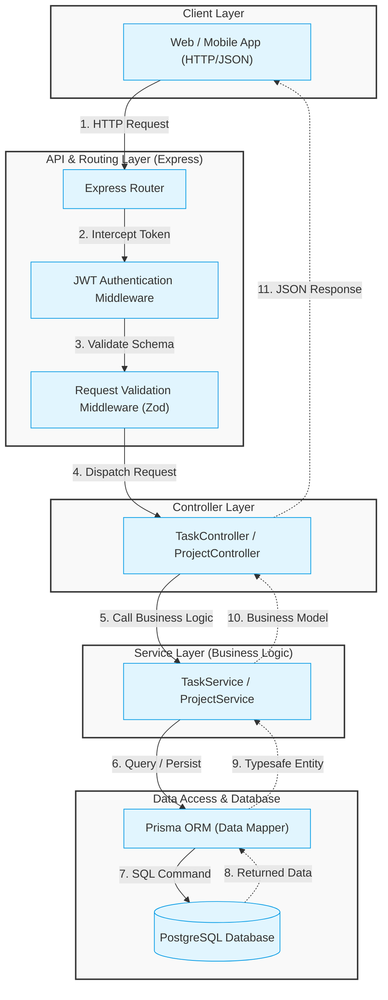
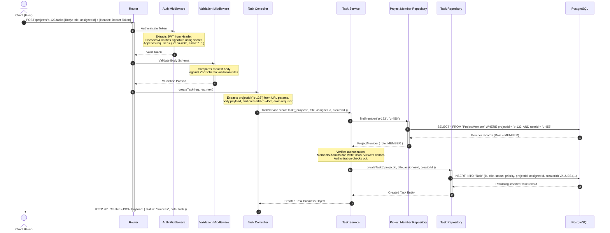

# System Architecture & Request Flow

This document details the high-level architecture, directory structure, and request-flow walkthrough for the Task Management System (TMS) backend. It is designed to be clean, modular, scalable, and easy to maintain by enforcing a strict separation of concerns.

---

## 1. High-Level Architecture Diagram

The system follows a layered **MVC/Three-Tier Architecture** pattern consisting of:
1. **Client / API Interface Layer**: The client application (web/mobile) sending HTTP requests.
2. **Routing & Middleware Layer**: Express routers direct traffic and intercept requests for cross-cutting concerns (e.g., authentication, request validation, rate limiting).
3. **Controller Layer**: Handles HTTP-specific request parsing, input sanitization, orchestrating calls to the business logic layer, and returning the proper HTTP response codes/shapes.
4. **Service (Business Logic) Layer**: The core of the application where all business rules, authorization checks, and logic live. Completely decoupled from HTTP frameworks.
5. **Repository (Data Access) Layer**: Interacts directly with the database using Prisma Client. Enforces type-safety and abstracts database-specific operations.
6. **Database Layer**: PostgreSQL instance storing normalized relational data.

### Layer Diagram



---

## 2. Directory Structure

Below is the folder structure. It keeps components grouped logically, separating routes, controllers, services, database schemas, and shared utilities.

```text
genzzi-tms-backend/
├── prisma/
│   ├── schema.prisma           # Prisma Database Models & Relations
│   └── migrations/             # SQL Migrations auto-generated by Prisma
├── src/
│   ├── config/
│   │   ├── env.ts              # Strongly typed environment variables validation
│   │   └── database.ts         # Singleton export of PrismaClient
│   ├── constants/
│   │   └── index.ts            # App-wide constants (e.g. error codes, roles)
│   ├── middlewares/
│   │   ├── auth.middleware.ts  # JWT verify, role-based authorization check
│   │   ├── error.middleware.ts # Global centralized error handler
│   │   └── validation.ts       # Zod request-body validation middleware
│   ├── routes/
│   │   ├── auth.routes.ts      # Authentication endpoints (Register, Login)
│   │   ├── project.routes.ts   # Project & member management endpoints
│   │   ├── task.routes.ts      # Task CRUD and status endpoints
│   │   └── index.ts            # Central router registry
│   ├── controllers/
│   │   ├── auth.controller.ts  # Controller mapping authentication logic
│   │   ├── project.controller.ts # Controller mapping projects logic
│   │   └── task.controller.ts  # Controller mapping tasks logic
│   ├── services/
│   │   ├── auth.service.ts     # Business logic for hashing, tokens
│   │   ├── project.service.ts  # Projects operations & ownership checks
│   │   └── task.service.ts     # Tasks actions & access control rules
│   ├── repositories/
│   │   ├── project.repo.ts     # Data access abstraction for Projects
│   │   └── task.repo.ts        # Data access abstraction for Tasks
│   ├── utils/
│   │   ├── errors.ts           # Custom error classes (AppError, UnauthorizedError)
│   │   └── logger.ts           # App logger (Winston/Pino)
│   └── app.ts                  # Express application configuration setup
├── .env                        # Local environment secrets configuration
├── package.json
├── tsconfig.json               # TypeScript compilation settings
└── README.md
```

---
### 3. Request-Flow Walkthrough: "Create a Task"

To illustrate how the layers interact, this is the step-by-step lifecycle of a `POST /api/v1/projects/:projectId/tasks` request to create a new task.



### Detailed Layer Description

1. **Client Request**:
   - The client submits a `POST` request to `https://api.genzzi-tms.com/api/v1/projects/p-123/tasks` with JSON payload: `{"title": "Implement auth integration", "assigneeId": "u-789", "priority": "HIGH"}`. The Authorization header contains a valid JWT: `Bearer Token`.

2. **Routing & Authentication**:
   - Express Router captures the route. Before forwarding to the controller, it passes the request through the `authMiddleware`.
   - `authMiddleware` checks for the Bearer token, validates it against the environment secret, and fetches/injects the user payload (`req.user = { id: 'u-456', role: 'USER' }`). If invalid, it immediately responds with `401 Unauthorized`.

3. **Schema Validation**:
   - The request hits the `validationMiddleware(createTaskSchema)`. This uses a schema validator like **Zod** to ensure that `title` is a non-empty string, `assigneeId` is a valid UUID, and `priority` matches one of the allowed enum values (`LOW`, `MEDIUM`, `HIGH`, `URGENT`). If validation fails, it throws a `400 Bad Request` with structured validation errors.
   
4. **Controller Action Dispatch**:
   - `TaskController.createTask` is triggered. It separates parameters from presentation concerns: extracts `projectId` from `req.params`, body fields from `req.body`, and `creatorId` from `req.user.id`. It passes this clean data transfer object (DTO) to `TaskService`.

5. **Business Logic & Authorization Check**:
   - `TaskService.createTask` runs.
   - It performs permission validation: queries the repository to check if `creatorId` (u-456) is a member of `projectId` (p-123) and has a role other than `VIEWER`. If the user is not part of the project, it throws a `403 Forbidden` error.
   - If `assigneeId` is provided, it verifies that the assignee is also a member of the project. If not, it throws a `400 Bad Request`.

6. **Database Abstraction (Prisma)**:
   - Once all business rules pass, the service requests `TaskRepository.create` to store the new entity.
   - Prisma constructs a parameterized SQL statement and executes it safely against PostgreSQL:
     ```sql
     INSERT INTO "Task" ("id", "title", "projectId", "assigneeId", "creatorId", "status", "priority", "createdAt", "updatedAt")
     VALUES ('t-uuid', 'Implement auth integration', 'p-123', 'u-789', 'u-456', 'TODO', 'HIGH', NOW(), NOW())
     RETURNING *;
     ```

7. **Structured Response**:
   - The database returns the newly created row. Prisma parses it into a typesafe JS object.
   - The service returns it to the controller.
   - The controller wraps the data inside a standardized envelope response format and sends it back to the client with an HTTP `201 Created` status code.
