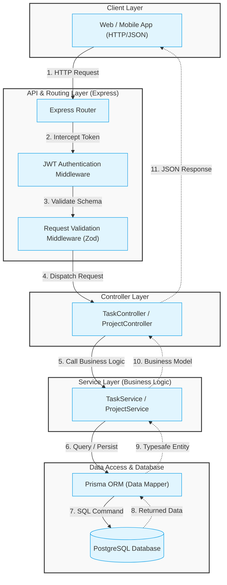

# System Architecture & Request Flow

This document details the high-level architecture, directory structure, and request-flow walkthrough for the Task Management System (TMS) backend. It is designed to be clean, modular, scalable, and easy to maintain by enforcing a strict separation of concerns.

---

## 1. High-Level Architecture Diagram

The system follows a layered **MVC/Three-Tier Architecture** pattern consisting of:
1. **Client / API Interface Layer**: The client application (web/mobile) sending HTTP requests.
2. **Routing & Middleware Layer**: Express routers direct traffic and intercept requests for cross-cutting concerns (e.g., authentication, request validation, rate limiting).
3. **Controller Layer**: Handles HTTP-specific request parsing, input sanitization, orchestrating calls to the business logic layer, and returning the proper HTTP response codes/shapes.
4. **Service (Business Logic) Layer**: The core of the application where all business rules, authorization checks, and logic live. Completely decoupled from HTTP frameworks.
5. **Repository (Data Access) Layer**: Interacts directly with the database using Prisma Client. Enforces type-safety and abstracts database-specific operations.
6. **Database Layer**: PostgreSQL instance storing normalized relational data.

### Layer Diagram



---

## 2. Directory Structure

Below is the folder structure. It keeps components grouped logically, separating routes, controllers, services, database schemas, and shared utilities.

```text
genzzi-tms-backend/
├── prisma/
│   ├── schema.prisma           # Prisma Database Models & Relations
│   └── migrations/             # SQL Migrations auto-generated by Prisma
├── src/
│   ├── config/
│   │   ├── env.ts              # Strongly typed environment variables validation
│   │   └── database.ts         # Singleton export of PrismaClient
│   ├── constants/
│   │   └── index.ts            # App-wide constants (e.g. error codes, roles)
│   ├── middlewares/
│   │   ├── auth.middleware.ts  # JWT verify, role-based authorization check
│   │   ├── error.middleware.ts # Global centralized error handler
│   │   └── validation.ts       # Zod request-body validation middleware
│   ├── routes/
│   │   ├── auth.routes.ts      # Authentication endpoints (Register, Login)
│   │   ├── project.routes.ts   # Project & member management endpoints
│   │   ├── task.routes.ts      # Task CRUD and status endpoints
│   │   └── index.ts            # Central router registry
│   ├── controllers/
│   │   ├── auth.controller.ts  # Controller mapping authentication logic
│   │   ├── project.controller.ts # Controller mapping projects logic
│   │   └── task.controller.ts  # Controller mapping tasks logic
│   ├── services/
│   │   ├── auth.service.ts     # Business logic for hashing, tokens
│   │   ├── project.service.ts  # Projects operations & ownership checks
│   │   └── task.service.ts     # Tasks actions & access control rules
│   ├── repositories/
│   │   ├── project.repo.ts     # Data access abstraction for Projects
│   │   └── task.repo.ts        # Data access abstraction for Tasks
│   ├── utils/
│   │   ├── errors.ts           # Custom error classes (AppError, UnauthorizedError)
│   │   └── logger.ts           # App logger (Winston/Pino)
│   └── app.ts                  # Express application configuration setup
├── .env                        # Local environment secrets configuration
├── package.json
├── tsconfig.json               # TypeScript compilation settings
└── README.md
```

---